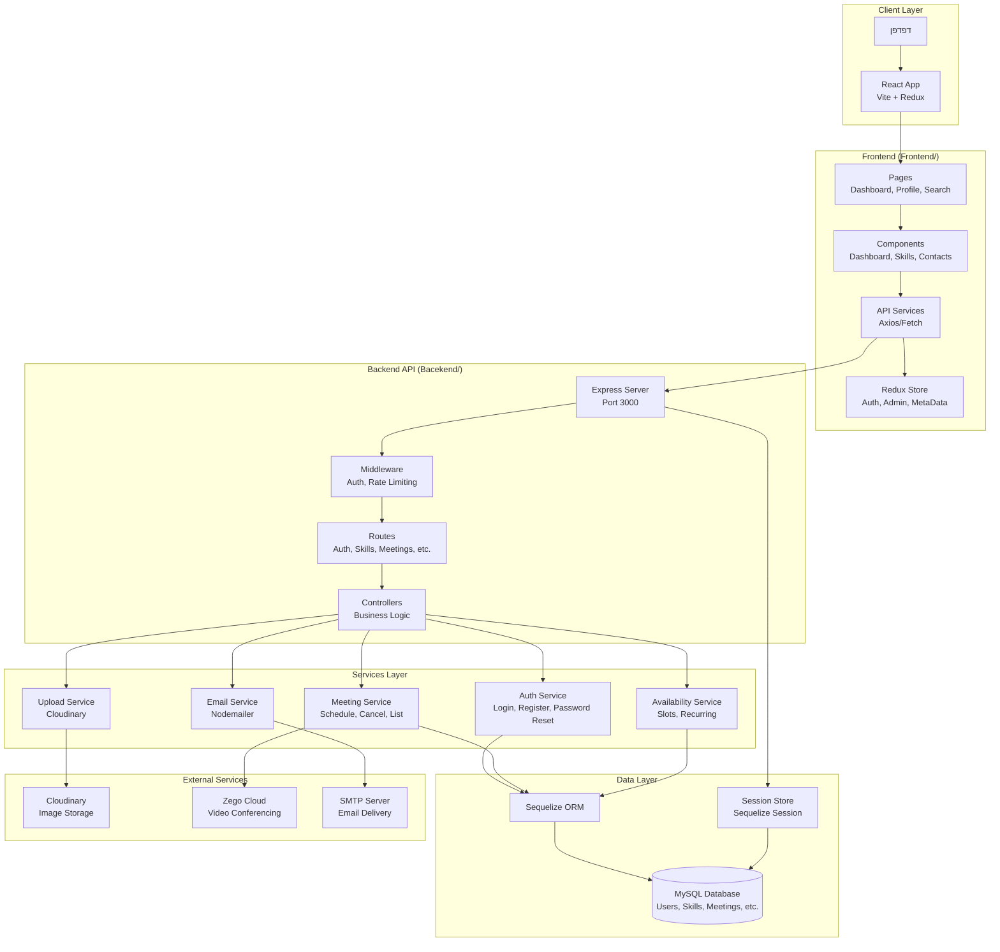

# ספר הפרויקט - Skill Matana

**גרסה:** 1.0  
**תאריך עדכון:** 2025-01-11  
**מחברים:** Eyal And Avichai

---

## תוכן עניינים

1. [תקציר מנהלים](#תקציר-מנהלים)
2. [סקירת סטאק וטכנולוגיות](#סקירת-סטאק-וטכנולוגיות)
3. [ארכיטקטורה לוגית](#ארכיטקטורה-לוגית)
4. [מבנה הריפו](#מבנה-הריפו)
5. [Backend](#backend)
6. [Frontend](#frontend)
7. [API Reference](#api-reference)
8. [ENV & קונפיגורציה](#env--קונפיגורציה)
9. [מאגרי נתונים](#מאגרי-נתונים)
10. [מרכיב חישובי/אלגוריתמי](#מרכיב-חישוביאלגוריתמי)
11. [בדיקות תוכנה](#בדיקות-תוכנה)
12. [חלופות ארכיטקטוניות](#חלופות-ארכיטקטוניות)
13. [פריסה ו-CI/CD](#פריסה-ו-cicd)
14. [אבטחה והגנה](#אבטחה-והגנה)
15. [מגבלות וחובות טכניות](#מגבלות-וחובות-טכניות)
16. [Roadmap קצר](#roadmap-קצר)
17. [נספחים](#נספחים)

---

## 1. תקציר מנהלים

### מה עושה המערכת?

**Skill Matana** היא פלטפורמה דיגיטלית לשיתוף ולמידת מיומנויות בחינם. המערכת מאפשרת למשתמשים:

- **ניהול מיומנויות**: הוספת מיומנויות אישיות, חיפוש משתמשים לפי מיומנויות, בקשת הוספת מיומנויות חדשות
- **חיבורים חברתיים**: שליחת בקשות חיבור, ניהול קשרים, חיפוש משתמשים לפי שם או מיומנות
- **ניהול זמינות**: יצירת סלוטי זמינות חד-פעמיים או חוזרים, הרשמה להתראות על זמינות חדשה
- **קביעת פגישות**: קביעת פגישות למידה עם משתמשים מחוברים, ניהול פגישות (ביטול, הצגה)
- **וידאו קונפרנס**: שילוב Zego Cloud להצטרפות לפגישות וידאו בזמן אמת
- **התראות מערכת**: ניהול התראות, תזכורות פגישות, התראות זמינות
- **ניהול אדמין**: ניהול משתמשים, מיומנויות, התראות, הרשאות

📷 **כאן תוצג תמונה מוצעת:** דשבורד המשתמש מציג סטטיסטיקות, פגישות קרובות, פעילות אחרונה וקיצורי דרך — `Frontend/src/pages/dashboard/Dashboard.jsx`

### למי מיועדת המערכת?

- **משתמשים רגילים**: אנשים המעוניינים ללמוד או ללמד מיומנויות
- **מנהלי מערכת (Admins)**: ניהול משתמשים, מיומנויות והתראות

### חוזקות בולטות (מבוסס קוד)

1. **ארכיטקטורה מובנית**: הפרדה ברורה בין שכבות (Routes → Controllers → Services → Models) (`Bacekend/`)
2. **אבטחה חזקה**: 
   - הצפנת סיסמאות עם bcrypt (`Bacekend/models/user.js:72-84`)
   - Session management מאובטח עם Sequelize Store (`Bacekend/app.js:26-35`)
   - Middleware להגנת XSS (xss-clean) ו-Helmet (`Bacekend/app.js:14-18`)
   - Rate limiting על endpoints רגישים (`Bacekend/routes/meetings.js:21`)
3. **ניהול מצב מתקדם**: Redux Toolkit עם slices מובנים (`Frontend/src/features/`)
4. **חוויית משתמש מודרנית**: 
   - Infinite scrolling (`Frontend/src/hooks/useInfiniteScroll.js`)
   - Debounced search (`Frontend/src/hooks/useDebounce.js`)
   - UI רספונסיבי עם SCSS modules (`Frontend/src/components/`)
5. **אינטגרציות חיצוניות**: 
   - Cloudinary לאחסון תמונות (`Bacekend/config/cloudinary.js`)
   - Zego Cloud לוידאו קונפרנס (`Bacekend/lib/zegoToken.js`)
   - SMTP לשליחת מיילים (`Bacekend/services/emailService.js`)
6. **תזכורות אוטומטיות**: Background job לתזכורות פגישות (`Bacekend/services/meetingReminderService.js:126-136`)
7. **בדיקות אוטומטיות**: Jest + React Testing Library (`Bacekend/tests/`, `Frontend/src/components/dashboard/*.test.jsx`)

📷 **כאן תוצג תמונה מוצעת:** דיאגרמת-על של המערכת המציגה את כל הרכיבים והקשרים — `diagrams/architecture.mmd`

---

## 2. סקירת סטאק וטכנולוגיות

### Backend

**שפת תכנות:** JavaScript (Node.js)  
**פריימוורק:** Express.js v4.21.2 (`Bacekend/package.json:22`)

**ספריות ליבה:**
- **ORM**: Sequelize v6.37.6 (`Bacekend/package.json:34`) - ניהול מסד נתונים
- **מסד נתונים**: MySQL2 v3.14.0 (`Bacekend/package.json:31`)
- **אימות**: bcrypt v5.1.1 (`Bacekend/package.json:16`) - הצפנת סיסמאות
- **Session**: express-session v1.18.1 + express-session-sequelize v2.3.0 (`Bacekend/package.json:24-25`)
- **ולידציה**: express-validator v7.2.1 (`Bacekend/package.json:26`)
- **אבטחה**: 
  - helmet v8.1.0 (`Bacekend/package.json:28`) - HTTP headers security
  - xss-clean v0.1.4 (`Bacekend/package.json:36`) - XSS protection
- **Rate Limiting**: express-rate-limit v8.1.0 (`Bacekend/package.json:23`)
- **Email**: nodemailer v7.0.6 (`Bacekend/package.json:32`)
- **Upload**: 
  - multer v2.0.1 (`Bacekend/package.json:30`)
  - cloudinary v2.7.0 (`Bacekend/package.json:17`)
- **Video**: @zegocloud/zego-uikit-prebuilt v2.16.0 (`Bacekend/package.json:14`)

**כלי פיתוח:**
- **Testing**: Jest v30.2.0 + Supertest v7.1.4 (`Bacekend/package.json:39-40`)
- **Migrations**: sequelize-cli v6.6.2 (`Bacekend/package.json:35`)

### Frontend

**שפת תכנות:** JavaScript (ES6+)  
**פריימוורק:** React v19.0.0 (`Frontend/package.json:24`)  
**Build Tool:** Vite v6.2.0 (`Frontend/package.json:54`)

**ספריות ליבה:**
- **State Management**: 
  - Redux Toolkit v2.7.0 (`Frontend/package.json:16`)
  - react-redux v9.2.0 (`Frontend/package.json:29`)
- **Routing**: react-router-dom v7.6.2 (`Frontend/package.json:30`)
- **HTTP Client**: axios v1.10.0 (`Frontend/package.json:19`)
- **Forms**: react-hook-form v7.58.1 (`Frontend/package.json:28`)
- **UI Components**: 
  - lucide-react v0.525.0 (`Frontend/package.json:23`) - אייקונים
  - framer-motion v12.18.1 (`Frontend/package.json:22`) - אנימציות
  - react-select v5.10.2 (`Frontend/package.json:31`) - Select components
- **Date/Time**: 
  - flatpickr v4.6.13 (`Frontend/package.json:21`)
  - react-flatpickr v4.0.11 (`Frontend/package.json:27`)
  - react-calendar v6.0.0 (`Frontend/package.json:25`)
- **Video**: @zegocloud/zego-uikit-prebuilt v2.16.0 (`Frontend/package.json:18`)
- **Styling**: 
  - sass v1.89.1 (`Frontend/package.json:33`)
  - SCSS Modules (מוגדר בקוד)

**כלי פיתוח:**
- **Testing**: 
  - Jest v30.2.0 (`Frontend/package.json:52`)
  - React Testing Library v16.3.0 (`Frontend/package.json:40`)
  - jest-environment-jsdom v30.2.0 (`Frontend/package.json:53`)
- **Linting**: ESLint v9.21.0 (`Frontend/package.json:47`)
- **Babel**: @babel/preset-env, @babel/preset-react (`Frontend/package.json:36-37`)

### מסד נתונים

**סוג:** MySQL (רלציוני)  
**ORM:** Sequelize v6.37.6  
**Migrations:** Sequelize CLI (`Bacekend/migrations/`)

### שירותים חיצוניים

- **Cloudinary**: אחסון תמונות (`Bacekend/config/cloudinary.js`)
- **Zego Cloud**: וידאו קונפרנס (`Bacekend/lib/zegoToken.js`)
- **SMTP**: שליחת מיילים (מוגדר ב-`Bacekend/services/emailService.js`)

---

## 3. ארכיטקטורה לוגית

המערכת בנויה בארכיטקטורת **3-Tier** עם הפרדה ברורה בין שכבות:

```
Client Layer (Browser)
    ↓
Frontend Layer (React + Redux)
    ↓
API Layer (Express)
    ↓
Services Layer (Business Logic)
    ↓
Data Layer (Sequelize + MySQL)
```

📷 **כאן תוצג תמונה מוצעת:** דיאגרמת ארכיטקטורה מלאה עם כל הרכיבים והקשרים — `diagrams/architecture.mmd`

### דיאגרמת ארכיטקטורה



📷 **כאן תוצג תמונה מוצעת:** דיאגרמת פריסה (אם יש K8s/Cloud) — לא נמצא בקוד

---

## 4. מבנה הריפו

### טבלת נתיב ↔ תפקיד

| נתיב | תפקיד | הערות |
| ---- | ----- | ----- |
| **Bacekend/** | שרת Backend (Node.js + Express) | שם התיקייה מכיל שגיאת כתיב (צריך להיות "Backend") |
| `Bacekend/app.js` | נקודת כניסה ראשית | הגדרת Express, middleware, routes |
| `Bacekend/config/` | קבצי תצורה | Database, Cloudinary |
| `Bacekend/controllers/` | Controllers - לוגיקה ברמת בקשה | 9 controllers |
| `Bacekend/services/` | Services - לוגיקה עסקית | 13 services |
| `Bacekend/models/` | מודלי Sequelize | 18 models |
| `Bacekend/routes/` | הגדרת routes | 11 route files |
| `Bacekend/middlewares/` | Middleware functions | Auth, Meeting |
| `Bacekend/migrations/` | Database migrations | Sequelize migrations |
| `Bacekend/seeders/` | Database seeders | נתוני התחלה |
| `Bacekend/tests/` | בדיקות אוטומטיות | Jest tests |
| `Bacekend/utils/` | כלי עזר | Database connection |
| `Bacekend/lib/` | ספריות חיצוניות | Zego token generation |
| **Frontend/** | אפליקציית React | Vite + React |
| `Frontend/src/` | קוד מקור Frontend | |
| `Frontend/src/pages/` | דפי האפליקציה | Dashboard, Auth, Admin, etc. |
| `Frontend/src/components/` | קומפוננטות React | 225 קבצים (139 .jsx) |
| `Frontend/src/features/` | Redux features | Auth, Admin, Search, MetaData |
| `Frontend/src/services/` | API services | meetingsAPI, notificationsAPI |
| `Frontend/src/routers/` | הגדרת routing | Route guards, protected routes |
| `Frontend/src/hooks/` | Custom React hooks | useDebounce, useInfiniteScroll |
| `Frontend/src/contexts/` | React Contexts | NotificationsContext |
| `Frontend/src/styles/` | SCSS global styles | Variables, mixins |
| `Frontend/public/` | קבצים סטטיים | תמונות, לוגו |
| **diagrams/** | דיאגרמות Mermaid | Architecture, Sequence, Data Model |
| **api-map.md** | מפת API מלאה | כל ה-endpoints |
| **env-table.md** | טבלת משתני סביבה | כל ה-ENV variables |
| **test-plan.md** | תכנית בדיקות | Unit + Integration tests |

---

## 5. Backend

### שכבות

המערכת בנויה בארכיטקטורת **Layered Architecture** עם הפרדה ברורה:

1. **Routes Layer** (`Bacekend/routes/`): הגדרת endpoints
2. **Controllers Layer** (`Bacekend/controllers/`): טיפול בבקשות HTTP
3. **Services Layer** (`Bacekend/services/`): לוגיקה עסקית
4. **Models Layer** (`Bacekend/models/`): מודלי Sequelize

### דפוסי תכן בשימוש

#### 1. Repository Pattern (דה-פקטו)
השימוש ב-Sequelize Models מהווה יישום של Repository Pattern:
- `Bacekend/models/user.js` - User repository
- `Bacekend/models/meeting.js` - Meeting repository
- כל המודלים ממוקמים ב-`Bacekend/models/index.js`

#### 2. Service Layer Pattern
לוגיקה עסקית מופרדת ל-Services:
- `Bacekend/services/authService.js` - אימות ורישום
- `Bacekend/services/meetingService.js` - ניהול פגישות
- `Bacekend/services/availabilityService.js` - ניהול זמינות

#### 3. Middleware Pattern
- `Bacekend/middlewares/authMiddleware.js` - אימות משתמשים
- `Bacekend/middlewares/meetingMiddleware.js` - בדיקת משתתפי פגישה
- Rate limiting middleware (`Bacekend/routes/meetings.js:21-36`)

#### 4. Transaction Pattern
שימוש ב-Sequelize Transactions לביצועים אטומיים:
- `Bacekend/services/meetingService.js:12-16` - Transaction בקביעת פגישה
- `Bacekend/controllers/authController.js:26` - Transaction בעדכון פרופיל

#### 5. Factory Pattern (חלקי)
יצירת טוקנים עם `generateToken04` (`Bacekend/lib/zegoToken.js:5`)

### מודלי נתונים / ORM

**ORM:** Sequelize v6.37.6  
**מסד נתונים:** MySQL

#### מודלים עיקריים:

1. **User** (`Bacekend/models/user.js`):
   - שדות: id, username, email, password (hashed), firstName, lastName, gender, status
   - Hooks: הצפנת סיסמה לפני יצירה/עדכון (`Bacekend/models/user.js:72-84`)

2. **Meeting** (`Bacekend/models/meeting.js`):
   - שדות: id, hostId, guestId, availabilityId, roomId, startTime, endTime, status, reminderSent
   - Indexes: host_id, guest_id, start_time, status (`Bacekend/models/meeting.js:57-62`)

3. **Availability** (`Bacekend/models/availability.js`):
   - שדות: id, userId, startTime, endTime, isBooked
   - Indexes: user_id, start_time, end_time

4. **Connection** (`Bacekend/models/connection.js`):
   - שדות: id, userA, userB
   - Unique constraint על (userA, userB) (`Bacekend/models/connection.js:30-33`)

5. **Skill** (`Bacekend/models/skill.js`):
   - שדות: id, name, status

6. **SystemNotification** (`Bacekend/models/systemNotification.js`):
   - שדות: id, userId, title, message, type, link, isRead

#### קשרים (Associations)

כל הקשרים מוגדרים ב-`Bacekend/models/associations.js`:

- **User ↔ Skill**: Many-to-Many דרך `SkillUser` (`Bacekend/models/associations.js:30-41`)
- **User ↔ Permission**: Many-to-Many דרך `UserPermission` (`Bacekend/models/associations.js:44-54`)
- **User ↔ Connection**: Many-to-Many דרך `Connection` (bidirectional) (`Bacekend/models/associations.js:119-131`)
- **User ↔ Availability**: One-to-Many (`Bacekend/models/associations.js:133-134`)
- **User ↔ Meeting**: One-to-Many (host/guest) (`Bacekend/models/associations.js:140-141`)
- **Availability ↔ Meeting**: One-to-One (`Bacekend/models/associations.js:143-144`)

📷 **כאן תוצג תמונה מוצעת:** תרשים מודל נתונים מלא עם כל הטבלאות והקשרים — `diagrams/data-model.mmd`

### אינטגרציות חוץ

#### 1. Cloudinary (אחסון תמונות)
- **קובץ:** `Bacekend/config/cloudinary.js`
- **שימוש:** העלאת תמונות פרופיל (`Bacekend/services/uploadService.js`)
- **נקודות כשל:** לא נמצא בקוד - נדרש אימות
- **ריטריי:** לא נמצא בקוד
- **Timeout:** לא נמצא בקוד

#### 2. Zego Cloud (וידאו קונפרנס)
- **קובץ:** `Bacekend/lib/zegoToken.js`
- **שימוש:** יצירת טוקנים להצטרפות לפגישות (`Bacekend/routes/meetings.js:66-83`)
- **נקודות כשל:** לא נמצא בקוד - נדרש אימות
- **ריטריי:** לא נמצא בקוד
- **Timeout:** לא נמצא בקוד

#### 3. SMTP (שליחת מיילים)
- **קובץ:** `Bacekend/services/emailService.js`
- **שימוש:** 
  - תזכורות פגישות (`Bacekend/services/meetingReminderService.js:116-117`)
  - איפוס סיסמה (`Bacekend/services/authService.js:184-256`)
  - התראות זמינות (`Bacekend/services/availabilityService.js:64-415`)
- **נקודות כשל:** לא נמצא בקוד - נדרש אימות
- **ריטריי:** לא נמצא בקוד
- **Timeout:** לא נמצא בקוד

### עומסים/ויסות

**Rate Limiting:**
- Meetings endpoints: 30 בקשות לדקה (`Bacekend/routes/meetings.js:21`)
- יישום fallback manual אם express-rate-limit לא זמין (`Bacekend/routes/meetings.js:23-36`)

**Body Size Limits:**
- JSON: 10MB (`Bacekend/app.js:46`)
- URL-encoded: 10MB (`Bacekend/app.js:47`)

### אבטחה

1. **הצפנת סיסמאות:** bcrypt עם salt 10 (`Bacekend/models/user.js:74`)
2. **Session Security:**
   - Sequelize Store (`Bacekend/app.js:20-24`)
   - Rolling sessions (`Bacekend/app.js:30`)
   - Cookie maxAge: 1 hour (`Bacekend/app.js:33`)
3. **XSS Protection:** xss-clean middleware (`Bacekend/app.js:14`)
4. **HTTP Headers:** Helmet middleware (`Bacekend/app.js:15`)
5. **CORS:** מוגדר עם credentials (`Bacekend/app.js:37-40`)
6. **Validation:** express-validator (`Bacekend/routes/validations/`)

### שרידות/התאוששות

- **Transactions:** שימוש ב-Sequelize transactions לביצועים אטומיים
- **Error Handling:** Error middleware מרכזי (`Bacekend/app.js:53-58`)
- **Background Jobs:** Meeting reminders (`Bacekend/services/meetingReminderService.js:126-136`)

📷 **כאן תוצג תמונה מוצעת:** תרשים רצף Login - תהליך התחברות מלא — `diagrams/sequence-auth.mmd`

📷 **כאן תוצג תמונה מוצעת:** תרשים רצף Meeting Scheduling - תהליך קביעת פגישה — `diagrams/sequence-meeting.mmd`

---

## 6. Frontend

### Framework

**React v19.0.0** עם **Vite v6.2.0** ככלי Build (`Frontend/package.json`)

### ארגון State

**Redux Toolkit v2.7.0** עם Slices (`Frontend/src/features/`):

1. **Auth Slice** (`Frontend/src/features/auth/AuthSlices.jsx`): ניהול אימות
2. **Admin Slice** (`Frontend/src/features/admin/AdminSlice.jsx`): ניהול אדמין
3. **Search Slice** (`Frontend/src/features/search/SearchSlice.jsx`): חיפוש
4. **MetaData Slice** (`Frontend/src/features/metaData/MetaDataSlices.jsx`): מטא-דאטה

**Store Configuration:** `Frontend/src/features/index.js`

### רוטינג

**react-router-dom v7.6.2** עם Route Guards (`Frontend/src/routers/`):

- **GuestRoute**: רק למשתמשים לא מחוברים (`Frontend/src/routers/GuestRoute.jsx`)
- **AuthenticatedRoute**: דורש התחברות (`Frontend/src/routers/AuthenticatedRoute.jsx`)
- **AdminRoute**: דורש הרשאות אדמין (`Frontend/src/routers/AdminRoute.jsx`)
- **ProtectedRoute**: דורש הרשאה ספציפית (`Frontend/src/routers/ProtectedRoute.jsx`)

**Routes:** `Frontend/src/routers/index.jsx`

### דפוסי UI

1. **Component Composition**: קומפוננטות קטנות וממוקדות (`Frontend/src/components/`)
2. **SCSS Modules**: Styling מודולרי (`Frontend/src/components/*.module.scss`)
3. **Custom Hooks**: 
   - `useDebounce` (`Frontend/src/hooks/useDebounce.js`) - Debounce לערכים
   - `useInfiniteScroll` (`Frontend/src/hooks/useInfiniteScroll.js`) - Infinite scrolling
   - `useModal` (`Frontend/src/hooks/useModal.jsx`) - ניהול מודלים
4. **Context API**: NotificationsContext (`Frontend/src/contexts/NotificationsContext.jsx`)

### טיפול שגיאות/טעינה

- **Loading States**: קומפוננטות מציגות מצבי טעינה (`Frontend/src/components/dashboard/LoadingSpinner.jsx`)
- **Error Handling**: טיפול בשגיאות API (`Frontend/src/components/ContactManagement/ErrorMessage.jsx`)
- **Empty States**: מצבים ריקים (`Frontend/src/components/ContactManagement/EmptyState.jsx`)

### אינטגרציית API

**Axios/Fetch** דרך Services:
- `Frontend/src/services/meetingsAPI.js` - Meetings API
- `Frontend/src/services/notificationsAPI.js` - Notifications API
- `Frontend/src/features/auth/AuthAPI.jsx` - Auth API
- `Frontend/src/features/admin/adminAPI.jsx` - Admin API

**Base URL:** מוגדר ב-`Frontend/src/config/env.js` (`VITE_API_URL`)

### UX צד אדמין/קצה

**Admin Panel:**
- ניהול משתמשים (`Frontend/src/components/UserManagement/`)
- ניהול מיומנויות (`Frontend/src/components/SkillManagement/`)
- ניהול התראות (`Frontend/src/components/NotificationManagement/`)

**User Dashboard:**
- סטטיסטיקות (`Frontend/src/components/dashboard/StatsGrid.jsx`)
- פגישות קרובות (`Frontend/src/components/dashboard/UpcomingMeetings.jsx`)
- פעילות אחרונה (`Frontend/src/components/dashboard/RecentActivity.jsx`)
- קיצורי דרך (`Frontend/src/components/dashboard/QuickActions.jsx`)

📷 **כאן תוצג תמונה מוצעת:** מסך Dashboard - סטטיסטיקות, פגישות, פעילות — `Frontend/src/pages/dashboard/Dashboard.jsx`

📷 **כאן תוצג תמונה מוצעת:** מסך חיפוש - חיפוש משתמשים לפי שם/מיומנות — `Frontend/src/pages/search/Search.jsx`

📷 **כאן תוצג תמונה מוצעת:** מסך ניהול זמינות - יצירת סלוטים, זמינות חוזרת — `Frontend/src/pages/user/MyAvailability.jsx`

---

## 7. API Reference

מפה מלאה של כל ה-endpoints נמצאת ב-`api-map.md`.

### דוגמאות קריאה

#### Login
```bash
curl -X POST http://localhost:3000/auth/login \
  -H "Content-Type: application/json" \
  -d '{"username": "user123", "password": "password123"}' \
  -c cookies.txt
```

#### Schedule Meeting
```bash
curl -X POST http://localhost:3000/meetings/schedule \
  -H "Content-Type: application/json" \
  -b cookies.txt \
  -d '{"targetUserId": 2, "availabilityId": 5}'
```

#### Get My Meetings
```bash
curl -X GET "http://localhost:3000/meetings/my?status=scheduled" \
  -b cookies.txt
```

#### Frontend (Axios)
```javascript
import axios from 'axios';

// Login
const response = await axios.post('http://localhost:3000/auth/login', {
  username: 'user123',
  password: 'password123'
}, { withCredentials: true });

// Get meetings
const meetings = await axios.get('http://localhost:3000/meetings/my', {
  params: { status: 'scheduled' },
  withCredentials: true
});
```

---

## 8. ENV & קונפיגורציה

טבלה מלאה של משתני סביבה נמצאת ב-`env-table.md`.

### קבצי תצורה

- **Backend:** `Bacekend/config/config.js` - Database configuration
- **Backend:** `Bacekend/config/cloudinary.js` - Cloudinary configuration
- **Frontend:** `Frontend/src/config/env.js` - API URL

### סביבות

המערכת תומכת ב-3 סביבות:
- **development**: `DB_USER_LOCAL`, `DB_PASS_LOCAL`, etc.
- **test**: `DB_USER_DEV`, `DB_PASS_DEV`, etc.
- **production**: `DB_USER_PROD`, `DB_PASS_PROD`, etc.

---

## 9. מאגרי נתונים

### מסד נתונים

**MySQL** עם **Sequelize ORM**

### סכימה

18 טבלאות עיקריות:
- `users` - משתמשים
- `skills` - מיומנויות
- `skill_users` - קשר Many-to-Many משתמש-מיומנות
- `permissions` - הרשאות
- `user_permissions` - קשר Many-to-Many משתמש-הרשאה
- `connections` - קשרים בין משתמשים
- `contact_requests` - בקשות חיבור
- `availabilities` - זמינות
- `recurring_availabilities` - זמינות חוזרת
- `meetings` - פגישות
- `meeting_alerts` - התראות זמינות
- `system_notifications` - התראות מערכת
- `user_images` - תמונות משתמשים
- `image_types` - סוגי תמונות
- `status` - סטטוסים
- `skill_requests` - בקשות מיומנות
- `password_reset_tokens` - טוקני איפוס סיסמה

### אינדקסים

- **users**: `username` (unique), `status`
- **meetings**: `host_id`, `guest_id`, `start_time`, `status`
- **availabilities**: `user_id`, `start_time`, `end_time`
- **connections**: `user_a`, `user_b` (unique pair)

### שאילתות כבדות

1. **Search Users** (`Bacekend/services/searchService.js:39-51`):
   - חיפוש לפי שם + מיומנויות
   - JOIN עם Skills ו-UserImages
   - סינון לפי userId (לא להציג את עצמי)

2. **List Meetings** (`Bacekend/services/meetingService.js:186-203`):
   - חיפוש לפי hostId או guestId
   - JOIN עם Users (host, guest)
   - סינון לפי status

---

## 10. מרכיב חישובי/אלגוריתמי

### 1. יצירת טוקן Zego (`Bacekend/lib/zegoToken.js`)

**מורכבות:** O(1)  
**תיאור:** יצירת טוקן הצפנה להצטרפות לפגישות וידאו
- אלגוריתם: AES-128/192/256-CBC
- Nonce אקראי
- IV אקראי
- TTL (Time To Live) מוגדר

### 2. חיפוש משתמשים (`Bacekend/services/searchService.js`)

**מורכבות:** O(n) כאשר n = מספר משתמשים  
**תיאור:** חיפוש משתמשים לפי שם ו/או מיומנויות
- LIKE queries על firstName, lastName, username
- INNER JOIN עם Skills אם skillId מסופק
- סינון לפי userId (לא להציג את עצמי)

### 3. בדיקת חפיפת זמינות (`Bacekend/services/availabilityService.js:25-44`)

**מורכבות:** O(m) כאשר m = מספר סלוטים קיימים  
**תיאור:** בדיקה אם סלוטים חדשים חופפים לסלוטים קיימים
- BETWEEN queries על startTime ו-endTime
- בדיקת חפיפה מלאה (סלוט חדש מכיל סלוט קיים או להיפך)

### 4. Background Job - תזכורות (`Bacekend/services/meetingReminderService.js`)

**מורכבות:** O(k) כאשר k = מספר פגישות היום  
**תיאור:** שליחת תזכורות לפגישות
- רץ כל שעה (`setInterval` 60*60*1000)
- סינון פגישות היום שלא נשלחה להם תזכורת
- שליחת מייל לכל משתתף

---

## 11. בדיקות תוכנה

תכנית בדיקות מלאה נמצאת ב-`test-plan.md`.

### סיכום

**Backend:**
- 5 בדיקות (Services, Controllers, Routes)
- Jest + Supertest
- Mocking מלא (מודלים, שירותים)

**Frontend:**
- 5 בדיקות (Dashboard components)
- Jest + React Testing Library
- Mocking של Redux, API calls

### הרצת בדיקות

```bash
# Backend
cd Bacekend
npm test

# Frontend
cd Frontend
npm test
```

---

## 12. חלופות ארכיטקטוניות

**לא נמצא בקוד** - אין תיעוד של חלופות ארכיטקטוניות שנשקלו.

---

## 13. פריסה ו-CI/CD

### פריסה

**לא נמצא בקוד** - אין קבצי Docker, Kubernetes, או CI/CD pipelines.

### סביבות

המערכת תומכת ב-3 סביבות (development, test, production) דרך משתני סביבה (`Bacekend/config/config.js`).

### Next Steps

- הוספת Dockerfile ל-Backend ו-Frontend
- הוספת docker-compose.yml לפריסה מקומית
- הוספת CI/CD pipeline (GitHub Actions / GitLab CI)
- הוספת Kubernetes manifests (אם רלוונטי)

---

## 14. אבטחה והגנה

### פרוטוקולים

- **HTTPS:** לא נמצא בקוד - נדרש אימות
- **Session:** express-session עם Sequelize Store
- **CORS:** מוגדר עם credentials (`Bacekend/app.js:37-40`)

### הרשאות / Roles / Claims

**Permission System:**
- טבלת `permissions` (`Bacekend/models/permission.js`)
- טבלת `user_permissions` (`Bacekend/models/userPermission.js`)
- Middleware `isAdmin` בודק permission id 99 (`Bacekend/middlewares/authMiddleware.js:10-18`)

### ולידציה

- **express-validator** (`Bacekend/routes/validations/`)
- Validation middleware (`Bacekend/routes/validations/validation.js`)

### סודות

- כל הסודות נשמרים ב-`.env` (לא בקוד)
- `.gitignore` מונע commit של `.env` (`Bacekend/.gitignore`, `Frontend/.gitignore`)

---

## 15. מגבלות וחובות טכניות

### מגבלות ידועות

1. **שם תיקייה:** `Bacekend` מכיל שגיאת כתיב (צריך להיות "Backend")
2. **Error Handling:** חלק מה-Services לא מטפלים בכל המקרים
3. **Testing Coverage:** כיסוי חלקי - חסרות בדיקות לרוב ה-Services
4. **CI/CD:** אין pipeline אוטומטי
5. **Docker:** אין containerization
6. **Monitoring:** אין ניטור/observability
7. **Documentation:** חלק מהקוד לא מתועד

### Next Steps חיוביים

1. **שיפור Testing:**
   - הוספת בדיקות ל-`authService`, `searchService`, `notificationsService`
   - הוספת בדיקות E2E מלאות
   - הוספת בדיקות נגישות

2. **שיפור אבטחה:**
   - הוספת HTTPS
   - הוספת rate limiting על יותר endpoints
   - הוספת CSRF protection

3. **שיפור ביצועים:**
   - הוספת caching (Redis)
   - אופטימיזציה של שאילתות
   - הוספת pagination ליותר endpoints

4. **שיפור DevOps:**
   - הוספת Docker
   - הוספת CI/CD
   - הוספת monitoring (Sentry, DataDog)

5. **שיפור UX:**
   - הוספת loading states ליותר מקומות
   - שיפור error messages
   - הוספת accessibility features

---

## 16. Roadmap קצר

**לא נמצא בקוד** - אין תיעוד של roadmap.

---

## 17. נספחים

### טבלת תלויות

**Backend Dependencies:** `Bacekend/package.json:12-36`  
**Frontend Dependencies:** `Frontend/package.json:13-33`

### מילון מונחים

- **Skill**: מיומנות שניתן ללמד/ללמוד
- **Availability**: סלוט זמן זמין לפגישה
- **Recurring Availability**: זמינות חוזרת (למשל כל יום שני 10:00-12:00)
- **Connection**: קשר בין שני משתמשים (לאחר אישור בקשה)
- **Contact Request**: בקשה לחיבור בין משתמשים
- **Meeting**: פגישת למידה מתוזמנת
- **Meeting Alert**: התראה על זמינות חדשה של משתמש
- **System Notification**: התראת מערכת למשתמש

### Inventory קבצים שנבדקו

**Backend:**
- `Bacekend/app.js`
- `Bacekend/routes/*.js` (11 files)
- `Bacekend/controllers/*.js` (9 files)
- `Bacekend/services/*.js` (13 files)
- `Bacekend/models/*.js` (18 files)
- `Bacekend/middlewares/*.js` (3 files)
- `Bacekend/config/*.js` (2 files)

**Frontend:**
- `Frontend/src/pages/**/*.jsx` (כ-30 files)
- `Frontend/src/components/**/*.jsx` (139 .jsx files)
- `Frontend/src/features/**/*.jsx` (כ-20 files)
- `Frontend/src/routers/*.jsx` (7 files)
- `Frontend/src/services/*.js` (2 files)

**Tests:**
- `Bacekend/tests/**/*.js` (5 files)
- `Frontend/src/components/dashboard/*.test.jsx` (5 files)

---

## Self-Check

### אימותים שבוצעו

✅ כל ה-endpoints מתועדים ב-`api-map.md` עם נתיבי קבצים  
✅ כל משתני הסביבה מתועדים ב-`env-table.md`  
✅ כל הבדיקות מתועדות ב-`test-plan.md`  
✅ דיאגרמות Mermaid נוצרו (architecture, sequence-auth, sequence-meeting, data-model)  
✅ כל הטענות מגובות בנתיבי קבצים ושורות קוד  
✅ אין המצאות - כל המידע מבוסס על הקוד  
✅ סימוני תמונות נוספו בכל המקומות הרלוונטיים  

### הערות

- שם התיקייה `Bacekend` מכיל שגיאת כתיב, אך נשמר כפי שהוא בקוד
- חלק מהתכונות (כגון CI/CD, Docker) לא נמצאו בקוד - צוין "לא נמצא בקוד"
- כל המידע מבוסס על סריקה מלאה של הריפו ללא הנחות מוקדמות

---

**סוף הספר**

